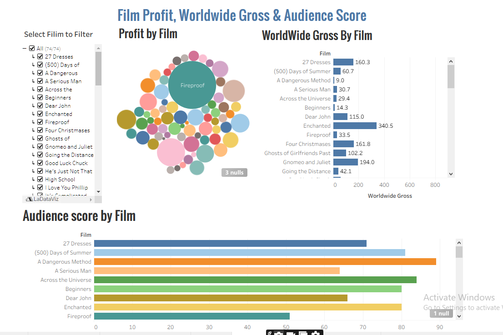

# 🎬 Film Profit, Worldwide Gross & Audience Score Dashboard

A Tableau dashboard that analyzes **film profitability**, **worldwide box office performance**, and **audience reception** in a single interactive view.  
This project demonstrates strong data visualization, analytical reasoning, and dashboard design using Tableau.

## 🖼️ Dashboard Preview

---

## 📊 Dashboard Overview

This dashboard focuses on three core film performance metrics:

### 1. Profit by Film
- Bubble chart visualization  
- Bubble size represents total profit  
- Quickly highlights high-profit and low-profit films  

### 2. Worldwide Gross by Film
- Horizontal bar chart  
- Displays total worldwide box office revenue  
- Enables ranking and comparative analysis  

### 3. Audience Score by Film
- Horizontal bar chart  
- Shows audience reception and popularity  
- Helps compare financial success vs audience sentiment  

A **Film filter** allows dynamic exploration across all visuals.

---

## 🎯 Key Insights

- Identify films with high profit but moderate box office gross  
- Compare audience appreciation vs commercial performance  
- Detect financial outliers  
- Perform quick comparative film analysis  

---

## 🛠 Tools & Technologies

- Tableau Desktop  
- Calculated Fields  
- Interactive Filters  
- Dashboard Actions  
- Data Visualization Best Practices  

---

## 📁 Project Structure

Film_Profits_WorldwideGross_AudienceScore_Dashboard/

├── Dashboard/

│   └── Film_Profits_WorldwideGross_AudienceScore_Dashboard.twb

├── Dataset/

│   └── HollywoodsMostProfitableStories.csv

├── Profit by Film.twb

├── Audience score by Film.twb

├── WorldWide Audience Score % by Film.twb

├── WorldWide Gross By Film.twb

├── Film_Profits_WorldwideGross_AudienceScore_Tableau_Dashboard.png

└── README.md

---

## ▶️ How to Use

1. Open the `.twbx` file in Tableau Desktop  
2. Use the Film filter to select one or more films  
3. Analyze profit, worldwide gross, and audience score together  
4. Hover over visuals to view tooltips  

---

## 📈 Business Value

Useful for:
- Film studios evaluating ROI  
- Analysts comparing audience vs revenue performance  
- BI portfolio projects  
- Interview and presentation demonstrations  

---

## 🚀 Future Enhancements

- Budget vs profit ratio analysis  
- Critic score integration  
- Year-wise trend analysis  
- Tableau Public publishing  

---

## 👤 Author

**Vijay**  
Data Analytics | BI | Tableau | Power BI  

Email: info@imsuccessconnection.com

If you find this useful, consider starring the repository.
